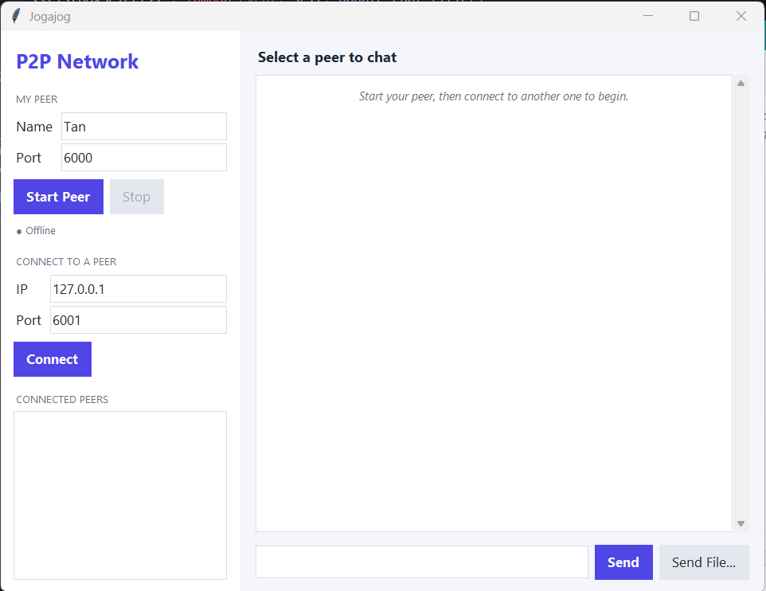
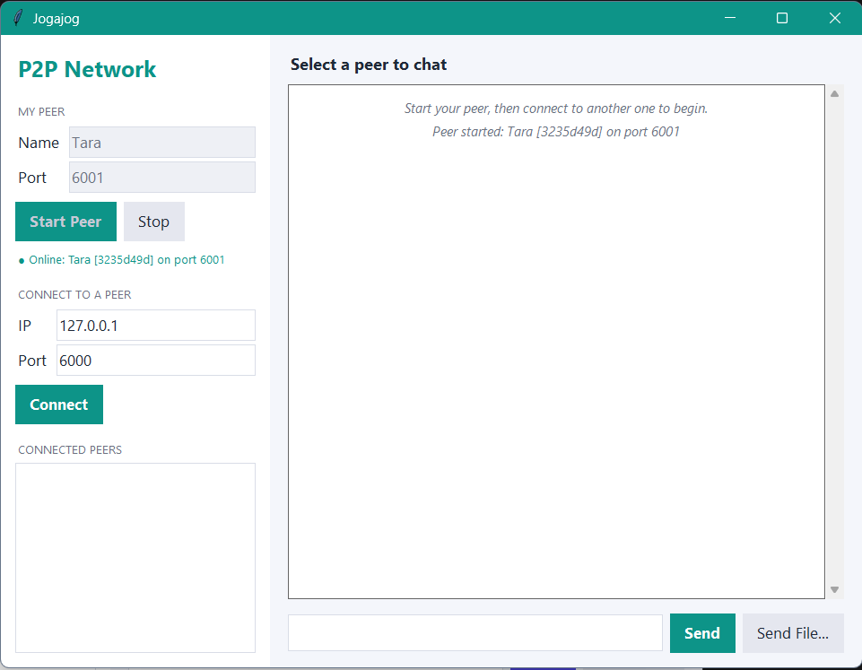
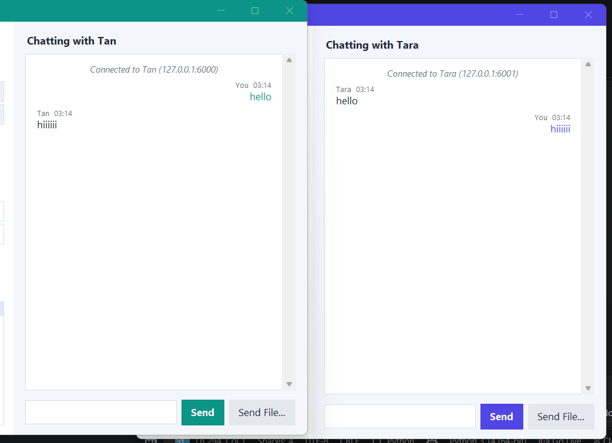
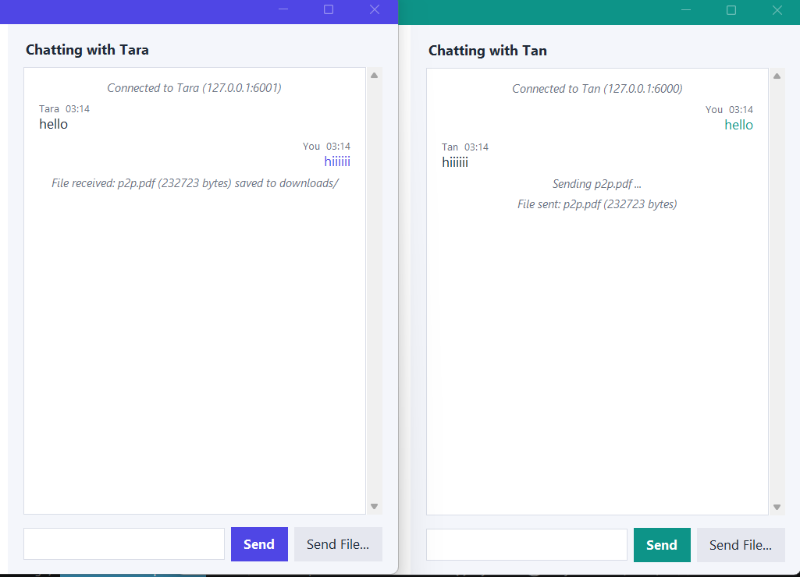
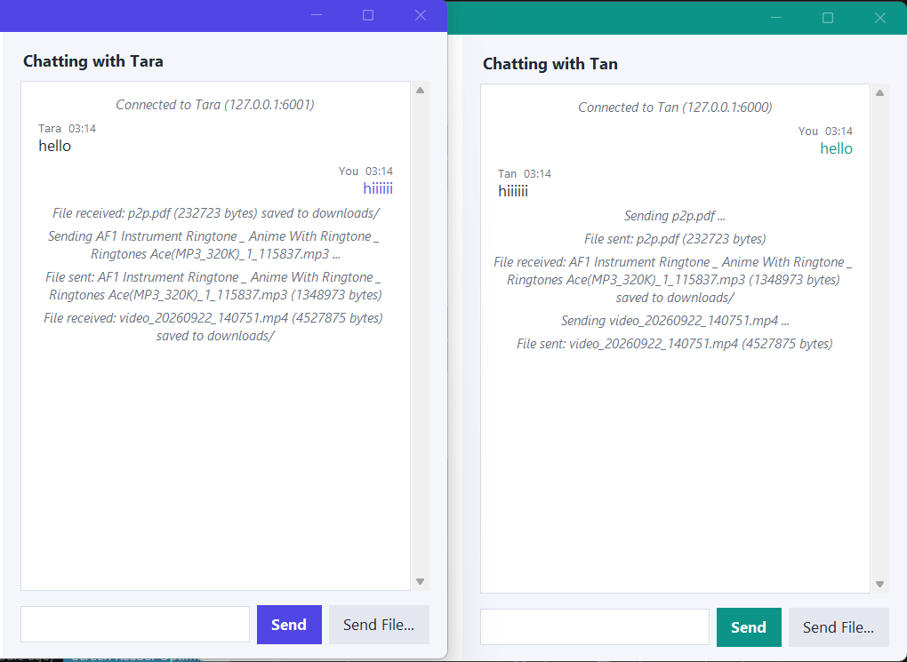
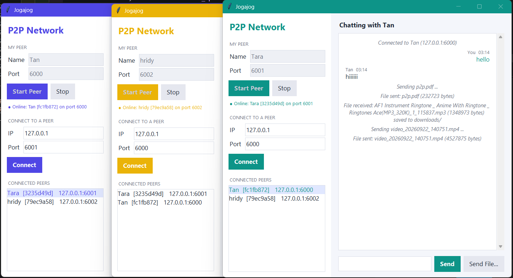
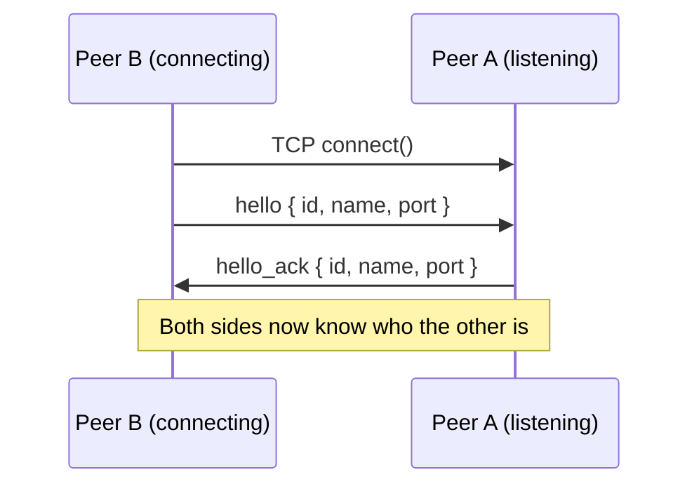
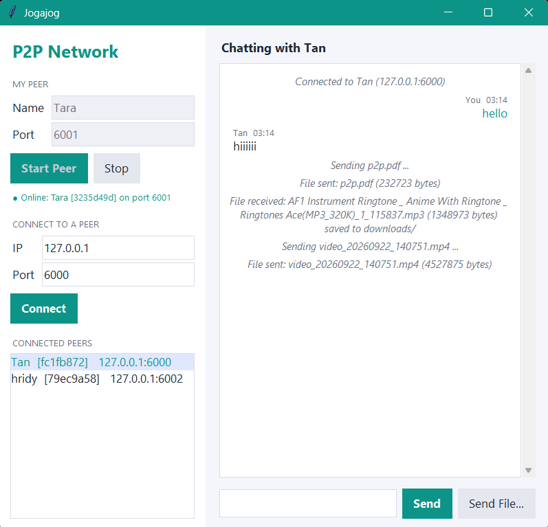
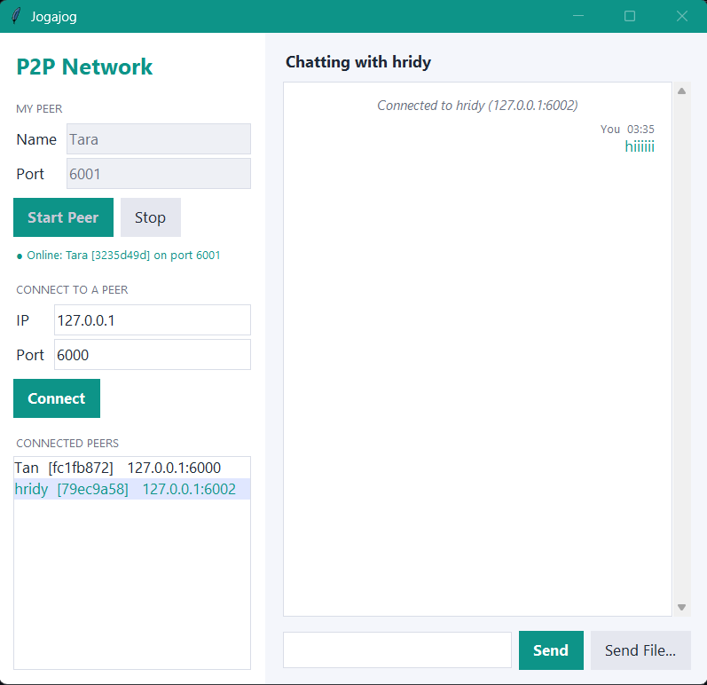
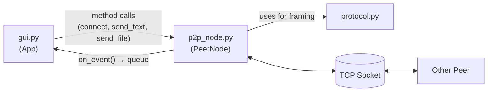

<div align="center">

# 🔗 Jogajog — Peer-to-Peer Network

**A serverless chat & file-sharing app built on raw TCP sockets**

*CSE 433 — Blockchain & Distributed Security Lab · University of Asia Pacific*


</div>

---

Every running copy of this app is **both a server and a client**. There's no backend, no cloud, no middleman — two peers find each other by IP and port and talk directly over a TCP socket, exchanging text messages and files of any kind.

```
   Peer A  ◄──────────►  Peer B
      ▲                     ▲
      │                     │
      └────────► Peer C ◄───┘
```

## 📑 Table of Contents

- [Features](#-features)
- [Screenshots](#️-screenshots)
- [Project Structure](#-project-structure)
- [Requirements](#️-requirements)
- [Getting Started](#-getting-started)
- [Connecting Two Peers](#-connecting-two-peers)
- [Chatting & Sending Files](#-chatting--sending-files)
- [One Window, Many Conversations](#-one-window-many-conversations)
- [How It Works](#-how-it-works)
- [Message Protocol](#-message-protocol)
- [Testing](#-testing)
- [Error Handling](#️-error-handling)
- [Limitations](#-limitations)
- [Not In Scope](#-not-in-scope)
- [Learn the Code](#-learn-the-code)

## ✨ Features

| | |
|---|---|
| 🖥️ **Server + Client in one** | Every peer listens for connections *and* dials out to others — no central server anywhere |
| 🤝 **Handshake** | `hello` / `hello_ack` messages so each side learns the other's ID, name, and port before chatting starts |
| 💬 **Direct text chat** | Message any connected peer, instantly, with no relay |
| 📁 **Any file type** | Images, audio, video, PDFs, ZIPs — sent as raw bytes in 64 KB chunks, not loaded into memory whole |
| 🧵 **Multi-peer, multi-thread** | One thread per connection, so you can talk to several peers at once without anything blocking |
| 🎨 **Color-coded peers** | Each peer auto-themes to its own accent color based on its port, so two windows never look identical |
| 🗂️ **Separate conversations** | Every connected peer gets its own private chat view — not one giant mixed log |
| 🛡️ **Graceful errors** | Refused connections, timeouts, and disconnects show up as a message in the log, never a crash |

## 🖼️ Screenshots
<div align="center">

| Peer A online | Peer B online |
|:---:|:---:|
|  |  |

| Text chat | PDF transfer |
|:---:|:---:|
|  |  |

| Audio & Video | Multiple Peer  |
|:---:|:---:|
|  |  |

</div>

## 📂 Project Structure

```text
P2P_Network/
├── main.py              # Entry point — builds the window, starts the event loop
├── gui.py                # Tkinter interface: sidebar, chat area, per-peer theming
├── p2p_node.py           # PeerNode: sockets, threads, handshake, send/receive
├── protocol.py           # Message framing (length prefix + JSON), constants
├── downloads/            # Files received from other peers land here
├── README.md             # You are here
└── CODE_EXPLANATION.md   # Line-by-line walkthrough of every function
```

| File | Job |
|---|---|
| `main.py` | Opens the Tk window and starts the GUI — nothing else |
| `gui.py` | Draws the UI and handles clicks; **zero** socket code |
| `p2p_node.py` | All networking: listen, connect, handshake, text, files |
| `protocol.py` | Turns Python dicts into wire bytes and back |

## ⚙️ Requirements

- 🐍 Python **3.10+** (the code uses `X | None` type hints)
- 📦 **No third-party packages** — just `socket`, `threading`, `json`, `struct`, `uuid`, `queue`, `tkinter`
- 🐧 Linux users may need: `sudo apt install python3-tk`

## 🚀 Getting Started

```bash
python main.py
```

Run it more than once — separate terminals, or separate computers on the same network to simulate multiple peers.

## 🔌 Connecting Two Peers

1. **Start Peer A** — name `Tan`, port `6000`, click **Start Peer**
2. **Start Peer B** (a second instance) — name `Tara`, port `6001`, click **Start Peer**
3. On **Peer B**, under *Connect to a peer*, enter `127.0.0.1` and `6000`, click **Connect**
4. Both windows now list each other under **Connected Peers** — each in its own color



> 💡 **On two computers?** Use the other machine's LAN IP (e.g. `192.168.1.10`) instead of `127.0.0.1`.

## 💬 Chatting & Sending Files

| To... | Do this |
|---|---|
| **Send a message** | Select a peer → type in the box → **Send** (or hit Enter) |
| **Send a file** | Select a peer → **Choose File(pdfs, audio, video) & Send** → pick anything |

Received files are saved automatically into `downloads/`.

## 🗂 One Window, Many Conversations

Each connected peer gets its **own chat history** — clicking a different name in the peer list switches the whole conversation view, exactly like switching threads in a messaging app instead of scrolling through one shared feed. Each peer is also auto-tinted to its own accent color (picked from its port number), so when you run two or three instances side by side for testing, they're visually easy to tell apart at a glance.
| Peer Tara's Conversation With TAN | Peer Tara's Conversation With hridy |
|:---:|:---:|
|  |  |

## 🧩 How It Works



- **GUI thread**: draws widgets, reads the event queue every 100 ms
- **Accept thread**: one, for the lifetime of the peer, waiting for new connections
- **Listen thread**: one *per connected peer*, blocking on incoming messages
- **Connect thread**: one per outgoing connection attempt, so a slow address never freezes the window

Tkinter isn't thread-safe, so network threads never touch a widget directly — they drop an event on a `queue.Queue` and the main thread picks it up.

### Message Framing

TCP is a byte stream with no concept of "messages." Every JSON message is prefixed with its own length so the receiver always knows exactly where it ends:

```
┌─────────────────────┬───────────────────────────┐
│  4 bytes (length)    │   N bytes (JSON payload)   │
└─────────────────────┴───────────────────────────┘
```

### File Transfer

```
sender   →  { "type": "file", "filename": "cat.jpg", "filesize": 204800 }
sender   →  [ raw bytes, streamed 64 KB at a time ]
receiver →  reads exactly `filesize` bytes → writes to downloads/
```

## 📨 Message Protocol

| Type | Sent by | Carries |
|---|---|---|
| `hello` | Connecting peer | `peer_id`, `peer_name`, `port` |
| `hello_ack` | Accepting peer | `peer_id`, `peer_name`, `port` |
| `text` | Either peer | `sender_id`, `sender_name`, `message` |
| `file` | Either peer | `sender_id`, `sender_name`, `filename`, `filesize` |

## 🧪 Testing

| Scenario | How |
|---|---|
| **Same computer** | Two terminals, ports `5000` / `5001`, connect via `127.0.0.1` |
| **Two computers** | Same Wi-Fi/LAN, connect via each other's local IP |
| **3+ peers** | Start Alice, Bob, and Charlie on different ports, cross-connect them, send files between every pair |

Try all file types: text, image, audio, video, PDF, ZIP.

## ⚠️ Error Handling

| Situation | What happens |
|---|---|
| Port already in use | Dialog box, peer isn't started |
| Connecting to a dead port | `Connection refused by <ip>:<port>` in the log |
| Connecting to an unreachable address | Times out after 5 seconds, logged |
| A peer disconnects mid-chat | Removed from the list, logged — other connections unaffected |
| Bad port number typed | Blocked before any socket opens |

## 🚧 Limitations

- 🔓 No encryption or authentication — everything is plain-text JSON
- 📍 No peer discovery — you must already know the IP and port
- 📝 A file with a name that already exists in `downloads/` gets overwritten
- 🧊 Sending a very large file can briefly freeze the window (it runs on the GUI thread)
<div align="center">

Built with 🐍 Python sockets, 🧵 threads, and no server at all.

</div>
